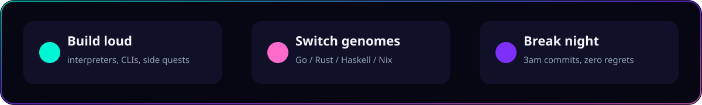

  

 

### I don't collect languages. I **weaponize** them.

  

 

## 🔥 what I'm actually about

I'm Bharat — I build **toy languages**, **bytecode VMs**, **CLIs**, and whatever cursed idea won't leave my head.

Not a tutorial guy. A *tear-it-apart-and-rebuild-it* guy.

 

| 🧪 Lab | 🗡️ Energy |
|:------|:---------|
| **ByteMe** | stack VM that eats bytes for breakfast |
| **monkeyscript** | a language with opinions |
| **rox / crox** | Lox bloodline. Unhinged parsers. |
| **GoChain · GoRedis · GoChat** | reinventing infrastructure for sport |
| **rustic · hive · syn** | systems gremlins |
| **nix-manager · agli · thelogguy** | ops magic + log necromancy |

 

## 🌈 stack? more like a **palette**

 

  

 

### 📡 transmission

**I like:** weird compilers · beautiful failures · PRs that slap  
**I hate:** sacred stacks · boring READMEs · sleeping on good ideas  

 

`github.com/bharatmanral` · **mode: feral** · status: compiling something cursed

 

